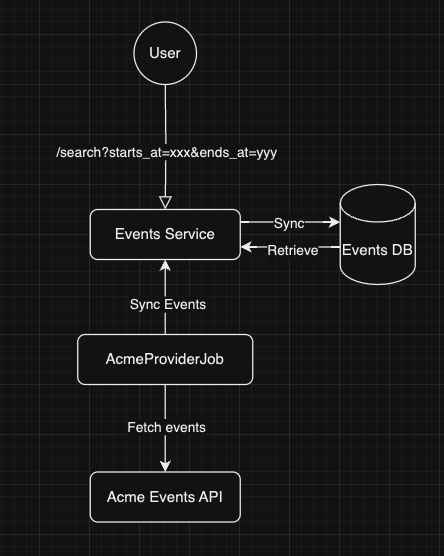
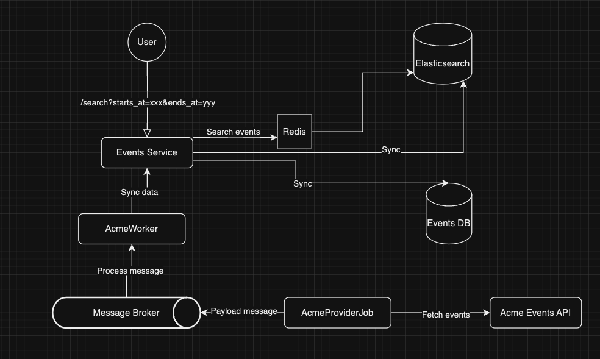

# Fever code challenge

### Considerations

I have developed the code challenge with PHP because it is the language I feel more comfortable with and because I 
already had a PHP skeleton to use.  
I have some Python knowledge and some experience, and I would have loved to implement it Python, but it would have 
taken me much longer to deliver it.

### Requirements

For simplicity and since the goal of the code challenge is evaluating only coding skills, this project runs using 
the PHP local server and uses a local SQLite database. Therefore, you need to have PHP (>=7.2) installed in your 
machine for running it. If you don't have PHP installed, please follow instructions for your operating system. 
You can use Homebrew if you are using macOS (https://medium.com/@ridanoor212/how-to-install-and-run-different-php-versions-using-homebrew-on-mac-acc3dad1bb0f)

### Start the project

Run `make run` from the root of this project to install all dependencies, create the database, run the 
migrations and start the server locally. You will see the following message when the server is running:

```
Listening on http://localhost:8080
Document root is {your project path here}
Press Ctrl-C to quit.
```

You might see some warnings when installing the dependencies. Some packages need to be replaced on my skeleton, but, 
you can ignore them for this code challenge as they are not affecting how the project works.

### Run Unit and Functional tests

Run `make test` from the root of this project. I have not created any integration test, API tests nor e2e for 
the code challenge. My skeleton does not support any of these tests at the moment but I will improve 
it eventually. Missing tests:
 - SQLiteEventRepository -> Integration tests with DB
 - SQLiteEventFinder -> Integration tests with DB
 - SearchEventsController -> An API test could be created to call the endpoint and check the retrieved values are the
from the example in the original README file.

### Run the worker to pupulate the DB

Run `./bin/console provider-job:acme`. Everytime it is executed, it will fetch the events from the API and sync the DB.

### Version control

I have been pushing code directly to my master/main branch for this challenge in order to go faster. In the real 
world, I would create different branches for features, creating Pull Requests and then merging into master/main.

### Endpoints

I have created 1 endpoint as understood from the requirements.

#### - GET /search?starts_at={startDate}&ends_at={endDate}

This endpoint retrieves the list of events within that date range. Both query params are mandatory and an error
is returned in case they are missing. There is also some validation about the format of the values sent.
Request example using CURL:

```
curl --location --request GET 'http://localhost:8080/search?starts_at=2021-02-01&ends_at=2022-07-03'
```

Example's response:

```
{
   "error":null,
   "data":{
      "events":[
         {
            "id":"22e27f77-289a-4774-8d2e-5f7b5f86e757",
            "title":"Camela en concierto",
            "start_date":"2021-06-30",
            "start_time":"21:00:00",
            "end_date":"2021-06-30",
            "end_time":"22:00:00",
            "min_price":15,
            "max_price":30
         },
         {
            "id":"b1b97610-ef5d-44da-aec0-1d5ec494bbc6",
            "title":"Los Morancos",
            "start_date":"2021-07-31",
            "start_time":"20:00:00",
            "end_date":"2021-07-31",
            "end_time":"21:00:00",
            "min_price":65,
            "max_price":75
         },
         {
            "id":"37dee941-b884-4f56-8e05-a007a6b5d3b1",
            "title":"Pantomima Full",
            "start_date":"2021-02-10",
            "start_time":"20:00:00",
            "end_date":"2021-02-10",
            "end_time":"21:30:00",
            "min_price":55,
            "max_price":55
         }
      ]
   }
}
```

## How to run the project

1. Set up the project: Execute `make run` from the source of the project (see Makefile)
2. Run the job to populate the database (you can run it as many times as you want). Open a new tab and Execute `./bin/console provider-job:acme` 
3. Call the endpoint to check the results: From another tab, execute `curl --location --request GET 'http://localhost:8080/search?starts_at=2021-02-01&ends_at=2022-07-03'`


## Architectural decisions

I have followed a simplistic DDD approach for this project as well as followed Hexagonal Architecture in order to be able to 
switch adapters in ports in the future if needed. Also, I have added a simple separation between Commands and 
Queries (CQRS), to show how this pattern could be applied. On this code challenge, the datastore is shared for both 
Commands and Queries. See later on this section other ways for implementing it. 

Some Domain events we created from the `Event` class, but they are not being used at the moment. It would be really easy to add a middleware which picks those events and do something with them (project 
them, persist them, publish them to a message broker, etc.).

The `TransactionalCommandHandler` class, allow us to create database transactions for the use cases we need them.

For the sake of simplicity, the architecture chosen for the code challenge is easy and "does the job". 
The diagram would look like this:



- We have one command (AcmeProviderJob) which takes care of synchronizing the event's information from the provider API. 
We can have as many jobs running as we want at the same time. We need to first execute it in order to populate the DB
- We have one endpoint where we can search for events in a given date range
- We have one SQLite DB where we store the data

## The extra mile

In order to take this service to production, many things would need to be improved in order to improve performance, 
scalability, observability, etc. 

- Use cronjobs or similar to execute the workers. They can be also pods in a k8s cluster 
- Use a production-ready database. We could choose a relation DB or a NoSQL DB to store the events. If the service 
evolves and supports any business logic that requires relationship between entities, we might go with something like PostgreSQL/MySQL. If it is as simple as it is
now, something like MongoDB could be enough. We could use sharding if we need it, even for really popular events only. 
Also, we could configure one (or several) master nodes in the DB to perform the data sync but use read-only replicas for
the search.
- Use a search engine (like Elasticseach) to improve the performance of the search of events. Sharding could be used
as well here.
- Use Redis for caching information that does not change frequently and/or for user session info in the future.
Also for caching responses for searchs for a period of time while the information is not updated. Add TTL to records in cache.
- Use tools like Datadog/New Relic to have visibility on what is going on in our system. These tools allow 
you to create dashboards, monitors, alerts, store logs, APM traces, etc. This will give us full visibility of the service
- Right now there is only one job (AcmeProviderJob) which pulls the info and persist it synchronously. This needs to be
improved, so we can have as many jobs as we want for the different providers. For this and with files containing thousands of events
with lots of information we could process the information asynchronously using a message broker to then let the workers 
read the info and persist it. This will add some complexity to the system as we will add eventual consistency problem now,
which I guess could be ok since we are implementing only the search. For the actual booking we would need to connect 
directly with the booking service which will deal with this.
So, for example, for big files with lots of events, I can think of a few options:
- Not too huge files: publish the whole payload to a message broker (RabbitMQ, SNS/SQS, Kafka) and workers will process the data
- Not too huge files: publish one message for each event to a message broker (RabbitMQ, SNS/SQS, Kafka) and workers will process the data
- Huge files: Push the whole file to something like S3 which can then trigger a message to a message broker so workers
can work in background to process the information.



### Things to improve

- Add missing tests explained in previous section
- Update some packages and the framework (Slim Framework)
- Include message broker and process event's information asynchronously
- Use docker for the local environment instead of the built-in PHP server (used for simplicity)
- Use [Money](https://martinfowler.com/eaaCatalog/money.html) pattern for min price and max price. For simplicity,
I have used floats which it is not the right way to deal with money data, normally it should be stored as an integer 
into the DB
